# 📊 ESP32 IoT System - Flow Chart (ESP32 Focused)

## 🎯 Flow Chart Tổng Quan - Tập Trung ESP32

```
┌─────────────────────────────────────────────────────────────────┐
│                    ESP32 IOT SYSTEM FLOW                         │
│                    (ESP32 là trung tâm)                          │
└─────────────────────────────────────────────────────────────────┘

                    ┌─────────────────┐
                    │   ESP32 DEVICE  │
                    │   (Main Focus)  │
                    └────────┬────────┘
                             │
        ┌────────────────────┼────────────────────┐
        │                    │                    │
        ▼                    ▼                    ▼
┌──────────────┐    ┌──────────────┐    ┌──────────────┐
│   SENSORS    │    │   CONTROL    │    │   NETWORK    │
│              │    │   DEVICES    │    │              │
│ - DHT11      │    │ - FAN        │    │ - WiFi       │
│ - MQ-135     │    │ - BUZZER     │    │ - HTTP       │
│ - MQ-7       │    │              │    │              │
│ - MQ-2       │    │              │    │              │
│ - GP2Y10     │    │              │    │              │
└──────────────┘    └──────────────┘    └──────┬───────┘
                                                 │
                                                 │ HTTP
                                                 │
                    ┌────────────────────────────▼──────────────┐
                    │      JAVA WEB SERVER (Support Only)       │
                    │  - Receive Data                           │
                    │  - Provide Thresholds                     │
                    └──────────────────┬────────────────────────┘
                                       │
                                       │ JDBC
                                       │
                    ┌──────────────────▼────────┐
                    │   SQL SERVER (Storage)    │
                    └───────────────────────────┘
```

---

## 🔄 FLOW CHART CHI TIẾT - ESP32 MAIN FLOW

```mermaid
flowchart TD
    Start([ESP32 Power On]) --> Init[Initialize System]
    
    Init --> InitSerial[Serial.begin 115200]
    InitSerial --> InitPins[Configure GPIO Pins]
    InitPins --> InitDHT[Initialize DHT Sensor]
    InitDHT --> LoadDefaults[Load Default Thresholds]
    
    LoadDefaults --> InitTemp[Temperature: 4 levels]
    LoadDefaults --> InitHum[Humidity: 3 levels]
    LoadDefaults --> InitMQ135[MQ135: 4 levels]
    LoadDefaults --> InitMQ2[MQ2 Gas: 4 levels]
    LoadDefaults --> InitCO[CO MQ7: 4 levels]
    LoadDefaults --> InitPM25[PM2.5: 5 levels]
    
    InitTemp --> ConnectWiFi[Connect to WiFi]
    InitHum --> ConnectWiFi
    InitMQ135 --> ConnectWiFI
    InitMQ2 --> ConnectWiFi
    InitCO --> ConnectWiFi
    InitPM25 --> ConnectWiFi
    
    ConnectWiFi --> WiFiCheck{WiFi<br/>Connected?}
    WiFiCheck -->|No| Retry[Retry Connection<br/>Max 30 attempts]
    Retry --> ConnectWiFi
    WiFiCheck -->|Yes| FirstPoll[Fetch Thresholds<br/>First Time]
    
    FirstPoll --> MainLoop[Enter Main Loop]
    
    MainLoop --> CheckSend{5 seconds<br/>elapsed?}
    CheckSend -->|No| CheckPoll
    CheckSend -->|Yes| ReadSensors[Read All Sensors]
    
    ReadSensors --> ReadDHT[Read DHT11<br/>Temperature & Humidity]
    ReadSensors --> ReadMQ1[Read MQ1_PIN 32<br/>MQ-135 Gas Sensor]
    ReadSensors --> ReadMQ2[Read MQ2_PIN 33<br/>MQ-7 CO Sensor]
    ReadSensors --> ReadMQ3[Read MQ3_PIN 34<br/>MQ-2 Gas/LPG Sensor]
    ReadSensors --> ReadDust[Read GP2Y10<br/>PM2.5 Dust Sensor]
    
    ReadDHT --> CheckThresholds[checkThresholds Function]
    ReadMQ1 --> CheckThresholds
    ReadMQ2 --> CheckThresholds
    ReadMQ3 --> CheckThresholds
    ReadDust --> CheckThresholds
    
    CheckThresholds --> FindLevels[For Each Sensor:<br/>findAlertLevel]
    FindLevels --> TempLevel[Temperature Alert Level]
    FindLevels --> HumLevel[Humidity Alert Level]
    FindLevels --> MQ135Level[MQ135 Alert Level]
    FindLevels --> MQ2Level[MQ2 Gas Alert Level]
    FindLevels --> COLevel[CO Alert Level]
    FindLevels --> PM25Level[PM2.5 Alert Level]
    
    TempLevel --> CalcAQI[Calculate AQI]
    HumLevel --> CalcAQI
    MQ135Level --> CalcAQI
    MQ2Level --> CalcAQI
    COLevel --> CalcAQI
    PM25Level --> CalcAQI
    
    CalcAQI --> FanLogic[FAN Control Logic]
    FanLogic --> FanRule1{AQI >= 75?}
    FanRule1 -->|Yes| FanON[FAN ON<br/>digitalWrite LOW]
    FanRule1 -->|No| FanRule2{Any Sensor<br/>Alert >= 2?}
    FanRule2 -->|Yes| FanON
    FanRule2 -->|No| FanRule3{Humidity<br/>Alert >= 1?}
    FanRule3 -->|Yes| FanON
    FanRule3 -->|No| FanOFF[FAN OFF<br/>digitalWrite HIGH]
    
    FanON --> BuzzerLogic
    FanOFF --> BuzzerLogic
    
    BuzzerLogic[BUZZER Control Logic] --> BuzzerRule1{Any Sensor<br/>Alert == 3?}
    BuzzerRule1 -->|Yes| BuzzerON[BUZZER ON<br/>digitalWrite LOW]
    BuzzerRule1 -->|No| BuzzerRule2{PM2.5 >= 2<br/>AND MQ >= 2?}
    BuzzerRule2 -->|Yes| BuzzerON
    BuzzerRule2 -->|No| BuzzerRule3{CO >= 2?}
    BuzzerRule3 -->|Yes| BuzzerON
    BuzzerRule3 -->|No| BuzzerRule4{Gas >= 2<br/>AND Hum >= 1?}
    BuzzerRule4 -->|Yes| BuzzerON
    BuzzerRule4 -->|No| BuzzerRule5{Temp >= 2<br/>AND PM2.5 >= 1<br/>AND AQI >= 100?}
    BuzzerRule5 -->|Yes| BuzzerON
    BuzzerRule5 -->|No| BuzzerOFF[BUZZER OFF<br/>digitalWrite HIGH]
    
    BuzzerON --> CreateJSON[Create JSON Payload]
    BuzzerOFF --> CreateJSON
    
    CreateJSON --> PostData[POST /api/data<br/>Send to Server]
    PostData --> ServerSave[(Server saves<br/>to Database)]
    ServerSave --> CheckPoll
    
    CheckPoll{10 seconds<br/>elapsed?}
    CheckPoll -->|No| CheckWiFi
    CheckPoll -->|Yes| GetThresholds[GET /api/poll<br/>Fetch Thresholds]
    
    GetThresholds --> ServerQuery[(Server queries<br/>Database)]
    ServerQuery --> ParseResponse[Parse JSON Response]
    ParseResponse --> HasThresholds{Response has<br/>thresholds?}
    HasThresholds -->|Yes| UpdateThresholds[Update Local<br/>Threshold Structure]
    HasThresholds -->|No| KeepDefaults[Keep Default<br/>Thresholds]
    
    UpdateThresholds --> ParseTemp[Parse Temperature Levels]
    UpdateThresholds --> ParseHum[Parse Humidity Levels]
    UpdateThresholds --> ParseMQ135[Parse MQ135 Levels]
    UpdateThresholds --> ParseMQ2[Parse MQ2 Levels]
    UpdateThresholds --> ParseCO[Parse CO Levels]
    UpdateThresholds --> ParsePM25[Parse PM2.5 Levels]
    
    ParseTemp --> CheckWiFi
    ParseHum --> CheckWiFi
    ParseMQ135 --> CheckWiFi
    ParseMQ2 --> CheckWiFi
    ParseCO --> CheckWiFi
    ParsePM25 --> CheckWiFi
    KeepDefaults --> CheckWiFi
    
    CheckWiFi{WiFi<br/>Still Connected?}
    CheckWiFi -->|No| ReconnectWiFi[Reconnect WiFi]
    ReconnectWiFi --> MainLoop
    CheckWiFi -->|Yes| Delay[Delay 200ms]
    Delay --> MainLoop
    
    style Start fill:#90EE90
    style MainLoop fill:#FFD700
    style CheckThresholds fill:#87CEEB
    style FanON fill:#FF6B6B
    style FanOFF fill:#51CF66
    style BuzzerON fill:#FF0000
    style BuzzerOFF fill:#51CF66
    style PostData fill:#4ECDC4
    style GetThresholds fill:#95E1D3
```



---

## 🔍 CHI TIẾT: ESP32 SETUP PHASE

```
┌─────────────────────────────────────────────────────────────────┐
│                    ESP32 SETUP() FUNCTION                        │
└─────────────────────────────────────────────────────────────────┘

START
  │
  ├─► Serial.begin(115200)
  │   └─► Initialize serial communication for debugging
  │
  ├─► Configure GPIO Pins
  │   ├─► pinMode(DUST_LED_PIN, OUTPUT)      // Pin 12
  │   ├─► pinMode(DUST_VOUT_PIN, INPUT)      // Pin 35
  │   ├─► pinMode(MQ1_PIN, INPUT)            // Pin 32 (MQ-135)
  │   ├─► pinMode(MQ2_PIN, INPUT)            // Pin 33 (MQ-7)
  │   ├─► pinMode(MQ3_PIN, INPUT)            // Pin 34 (MQ-2)
  │   ├─► pinMode(FAN_PIN, OUTPUT)           // Pin 18
  │   └─► pinMode(BUZZER_PIN, OUTPUT)        // Pin 19
  │
  ├─► Initialize DHT Sensor
  │   └─► dht.begin()
  │
  ├─► Set Control Devices to OFF (HIGH = OFF)
  │   ├─► digitalWrite(FAN_PIN, HIGH)        // FAN OFF
  │   └─► digitalWrite(BUZZER_PIN, HIGH)     // BUZZER OFF
  │
  ├─► Load Default Thresholds
  │   └─► initDefaultThresholds()
  │       ├─► Temperature: 4 levels
  │       │   ├─► Level 0: "Lạnh" (-40 to 18°C, Alert 0)
  │       │   ├─► Level 1: "Bình thường" (18 to 32°C, Alert 0)
  │       │   ├─► Level 2: "Nóng" (32 to 39°C, Alert 1)
  │       │   └─► Level 3: "Rất nguy hiểm" (39 to 80°C, Alert 2)
  │       │
  │       ├─► Humidity: 3 levels
  │       │   ├─► Level 0: "Khô" (0 to 30%, Alert 1)
  │       │   ├─► Level 1: "Bình thường" (30 to 70%, Alert 0)
  │       │   └─► Level 2: "Ẩm" (70 to 85%, Alert 1)
  │       │
  │       ├─► MQ135 (Air Quality): 4 levels
  │       │   ├─► Level 0: "Tốt" (0 to 50 ppm, Alert 0)
  │       │   ├─► Level 1: "Trung bình" (50 to 150 ppm, Alert 1)
  │       │   ├─► Level 2: "Nguy hiểm" (150 to 300 ppm, Alert 2)
  │       │   └─► Level 3: "Rất nguy hiểm" (300 to 600 ppm, Alert 3)
  │       │
  │       ├─► MQ2 (Gas/LPG): 4 levels
  │       │   ├─► Level 0: "An toàn" (0 to 300 ppm, Alert 0)
  │       │   ├─► Level 1: "Chú ý" (300 to 1000 ppm, Alert 1)
  │       │   ├─► Level 2: "Rò rỉ" (1000 to 5000 ppm, Alert 2)
  │       │   └─► Level 3: "Rất nguy hiểm" (5000 to 10000 ppm, Alert 3)
  │       │
  │       ├─► CO (MQ-7): 4 levels
  │       │   ├─► Level 0: "An toàn" (0 to 50 ppm, Alert 0)
  │       │   ├─► Level 1: "Chú ý" (50 to 200 ppm, Alert 1)
  │       │   ├─► Level 2: "Nguy hiểm" (200 to 800 ppm, Alert 2)
  │       │   └─► Level 3: "Rất nguy hiểm" (800 to 2000 ppm, Alert 3)
  │       │
  │       └─► PM2.5 (Dust): 5 levels
  │           ├─► Level 0: "Tốt" (0 to 12 µg/m³, Alert 0)
  │           ├─► Level 1: "Trung bình" (12 to 35 µg/m³, Alert 1)
  │           ├─► Level 2: "Kém" (35 to 55 µg/m³, Alert 2)
  │           ├─► Level 3: "Xấu" (55 to 150 µg/m³, Alert 2)
  │           └─► Level 4: "Rất nguy hiểm" (150 to 500 µg/m³, Alert 3)
  │
  ├─► Connect WiFi
  │   └─► connectWiFi()
  │       ├─► WiFi.mode(WIFI_STA)
  │       ├─► WiFi.begin(SSID, PASSWORD)
  │       └─► Wait for connection (max 30 attempts × 500ms = 15s)
  │
  ├─► IF WiFi Connected:
  │   └─► fetchThresholds() [First time only]
  │       └─► GET /api/poll?deviceId=DEVICE001
  │           └─► Update thresholds from server (if available)
  │
  └─► ENTER MAIN LOOP
```

---

## 🔄 CHI TIẾT: ESP32 MAIN LOOP

```
┌─────────────────────────────────────────────────────────────────┐
│                    ESP32 loop() FUNCTION                         │
└─────────────────────────────────────────────────────────────────┘

LOOP START
  │
  ├─► Get Current Time: currentMillis = millis()
  │
  ├─► CHECK 1: Time to Send Data? (Every 5 seconds)
  │   │
  │   └─► IF (currentMillis - lastSend >= 5000):
  │       │
  │       ├─► Update lastSend = currentMillis
  │       │
  │       └─► readAndSend()
  │           │
  │           ├─► STEP 1: Read All Sensors
  │           │   ├─► DHT11:
  │           │   │   ├─► humidity = dht.readHumidity()
  │           │   │   └─► temperature = dht.readTemperature()
  │           │   │
  │           │   ├─► MQ Sensors (Analog):
  │           │   │   ├─► mq135 = analogRead(MQ1_PIN)    // Pin 32
  │           │   │   ├─► mq7 = analogRead(MQ2_PIN)      // Pin 33
  │           │   │   └─► mq2 = analogRead(MQ3_PIN)      // Pin 34
  │           │   │
  │           │   └─► Dust Sensor (GP2Y10):
  │           │       ├─► digitalWrite(DUST_LED_PIN, LOW)
  │           │       ├─► delayMicroseconds(280)
  │           │       ├─► dustRaw = analogRead(DUST_VOUT_PIN)
  │           │       ├─► delayMicroseconds(40)
  │           │       ├─► digitalWrite(DUST_LED_PIN, HIGH)
  │           │       ├─► delayMicroseconds(9680)
  │           │       ├─► voltage = dustRaw * (3.3 / 4095.0)
  │           │       └─► pm25 = (voltage - 0.9) * 1000 / 0.5
  │           │
  │           ├─► STEP 2: Check Thresholds & Control Devices
  │           │   └─► checkThresholds(temperature, humidity, mq135, mq7, mq2, pm25)
  │           │       │
  │           │       ├─► For Each Sensor: Find Alert Level
  │           │       │   └─► findAlertLevel(value, sensorThresholds)
  │           │       │       └─► Loop through levels → Find matching range
  │           │       │
  │           │       ├─► Calculate AQI
  │           │       │   └─► AQI = (pm25/500)*500 + (mq7/2000)*200 + (mq135/10000)*150
  │           │       │
  │           │       ├─► FAN Control
  │           │       │   └─► Apply FAN rules → digitalWrite(FAN_PIN, HIGH/LOW)
  │           │       │
  │           │       └─► BUZZER Control
  │           │           └─► Apply BUZZER rules → digitalWrite(BUZZER_PIN, HIGH/LOW)
  │           │
  │           ├─► STEP 3: Create JSON Payload
  │           │   {
  │           │     "deviceId": "DEVICE001",
  │           │     "temperature": 25.5,
  │           │     "humidity": 60.0,
  │           │     "mq135": 250,
  │           │     "mq7": 280,
  │           │     "mq2": 550,
  │           │     "dust": 35.0
  │           │   }
  │           │
  │           └─► STEP 4: Send to Server
  │               └─► POST /api/data
  │                   └─► Server saves to database (background)
  │
  ├─► CHECK 2: Time to Poll Thresholds? (Every 10 seconds)
  │   │
  │   └─► IF (currentMillis - lastPoll >= 10000):
  │       │
  │       ├─► Update lastPoll = currentMillis
  │       │
  │       └─► IF WiFi Connected:
  │           └─► fetchThresholds()
  │               │
  │               ├─► GET /api/poll?deviceId=DEVICE001
  │               │
  │               ├─► Parse JSON Response
  │               │   {
  │               │     "update": true,
  │               │     "thresholds": {
  │               │       "temperature": [...],
  │               │       "humidity": [...],
  │               │       "mq135": [...],
  │               │       "mq2": [...],
  │               │       "co": [...],
  │               │       "pm25": [...]
  │               │     }
  │               │   }
  │               │
  │               └─► Update Local Threshold Structure
  │                   └─► thresholds.loaded = true
  │
  └─► CHECK 3: WiFi Still Connected?
      │
      └─► IF WiFi Disconnected:
          ├─► Reconnect WiFi
          └─► IF reconnected AND thresholds not loaded:
              └─► fetchThresholds()
  │
  └─► delay(200ms)
  └─► LOOP AGAIN
```

---

## 🎛️ CHI TIẾT: checkThresholds() Function

```
┌─────────────────────────────────────────────────────────────────┐
│              checkThresholds() - Core Logic                      │
└─────────────────────────────────────────────────────────────────┘

INPUT: temperature, humidity, mq135, mq7, mq2, pm25
  │
  ├─► STEP 1: Find Alert Level for Each Sensor
  │   │
  │   ├─► findAlertLevel(temperature, thresholds.temperature)
  │   │   └─► Loop through 4 levels
  │   │       └─► IF value >= minValue AND value < maxValue:
  │   │           └─► Return: alertLevel, levelName, message
  │   │
  │   ├─► findAlertLevel(humidity, thresholds.humidity)
  │   ├─► findAlertLevel(mq135, thresholds.mq135)
  │   ├─► findAlertLevel(mq2, thresholds.mq2)
  │   ├─► findAlertLevel(mq7, thresholds.co)
  │   └─► findAlertLevel(pm25, thresholds.pm25)
  │
  ├─► STEP 2: Calculate AQI
  │   └─► calculateAQI(pm25, mq7, mq135)
  │       └─► AQI = (pm25/500)*500 + (mq7/2000)*200 + (mq135/10000)*150
  │
  ├─► STEP 3: FAN Control Decision
  │   │
  │   ├─► Rule 1: IF AQI >= 75 → FAN ON
  │   ├─► Rule 2: IF any sensor AlertLevel >= 2 (except humidity) → FAN ON
  │   └─► Rule 3: IF humidity AlertLevel >= 1 → FAN ON
  │   │
  │   └─► Execute: digitalWrite(FAN_PIN, LOW) // ON
  │       OR: digitalWrite(FAN_PIN, HIGH) // OFF
  │
  └─► STEP 4: BUZZER Control Decision
      │
      ├─► Rule 1: IF any sensor AlertLevel == 3 → BUZZER ON
      ├─► Rule 2: IF humidity AlertLevel >= 1 → BUZZER ON
      ├─► Rule 3: IF PM2.5 Alert >= 2 AND any MQ Alert >= 2 → BUZZER ON
      ├─► Rule 4: IF CO Alert >= 2 → BUZZER ON
      ├─► Rule 5: IF (MQ135 OR MQ2) Alert >= 2 AND humidity Alert >= 1 → BUZZER ON
      └─► Rule 6: IF temp Alert >= 2 AND PM2.5 Alert >= 1 AND AQI >= 100 → BUZZER ON
      │
      └─► Execute: digitalWrite(BUZZER_PIN, LOW) // ON
          OR: digitalWrite(BUZZER_PIN, HIGH) // OFF
```

---

## 📡 CHI TIẾT: Network Communication (Simplified)

```
┌─────────────────────────────────────────────────────────────────┐
│              ESP32 ↔ SERVER Communication                        │
└─────────────────────────────────────────────────────────────────┘

┌─────────────────────────────────────────────────────────────┐
│  ESP32 → SERVER: Send Sensor Data                            │
│  POST /api/data (Every 5 seconds)                            │
└─────────────────────────────────────────────────────────────┘

ESP32: sendToServer(jsonPayload)
  │
  ├─► Check WiFi Connection
  │   └─► IF NOT Connected → Skip (return)
  │
  ├─► HTTP POST Request
  │   ├─► URL: http://192.168.137.1:8080/IoTWebApp/api/data
  │   ├─► Content-Type: application/json
  │   └─► Body: JSON payload
  │
  └─► Server Response
      └─► {"status": "ok", "received": true}
          │
          └─► [Server saves to database in background - ESP32 doesn't care]

┌─────────────────────────────────────────────────────────────┐
│  ESP32 ← SERVER: Get Threshold Updates                       │
│  GET /api/poll?deviceId=DEVICE001 (Every 10 seconds)         │
└─────────────────────────────────────────────────────────────┘

ESP32: fetchThresholds()
  │
  ├─► Check WiFi Connection
  │   └─► IF NOT Connected → Skip (return)
  │
  ├─► HTTP GET Request
  │   └─► URL: http://192.168.137.1:8080/IoTWebApp/api/poll?deviceId=DEVICE001
  │
  ├─► Parse JSON Response
  │   └─► IF update == true AND thresholds exists:
  │       ├─► Parse temperature levels
  │       ├─► Parse humidity levels
  │       ├─► Parse mq135 levels
  │       ├─► Parse mq2 (CO) levels
  │       ├─► Parse mq3 (Gas/LPG) levels
  │       └─► Parse pm25 levels
  │
  └─► Update Local Threshold Structure
      └─► thresholds.loaded = true
```

---

## 🎯 SIMPLIFIED SYSTEM OVERVIEW

```
                    ┌─────────────────────────────────┐
                    │         ESP32 DEVICE            │
                    │      (Main Controller)          │
                    │                                 │
                    │  ┌───────────────────────────┐  │
                    │  │   Sensor Reading Loop     │  │
                    │  │   (Every 5 seconds)       │  │
                    │  └───────────┬───────────────┘  │
                    │              │                   │
                    │  ┌───────────▼───────────────┐  │
                    │  │  Threshold Checking       │  │
                    │  │  & Device Control         │  │
                    │  └───────────┬───────────────┘  │
                    │              │                   │
                    │  ┌───────────▼───────────────┐  │
                    │  │  Send Data to Server      │  │
                    │  │  POST /api/data           │  │
                    │  └───────────┬───────────────┘  │
                    │              │                   │
                    │  ┌───────────▼───────────────┐  │
                    │  │  Poll Thresholds          │  │
                    │  │  GET /api/poll            │  │
                    │  │  (Every 10 seconds)       │  │
                    │  └───────────────────────────┘  │
                    └──────────────┬──────────────────┘
                                   │
                                   │ HTTP
                                   │
                    ┌──────────────▼──────────────────┐
                    │    JAVA WEB SERVER              │
                    │    (Support Role Only)          │
                    │                                 │
                    │  - Receives data                │
                    │  - Stores to database           │
                    │  - Provides thresholds          │
                    └──────────────┬──────────────────┘
                                   │
                                   │ JDBC
                                   │
                    ┌──────────────▼──────────────────┐
                    │    SQL SERVER DATABASE          │
                    │    (Storage Only)               │
                    │                                 │
                    │  - Stores sensor data           │
                    │  - Stores threshold config      │
                    └─────────────────────────────────┘
```

---

## ⏱️ TIMING DIAGRAM - ESP32 CYCLE

```
Time (seconds)
│
0s ──────────────────────────────────────────────────────────────
   │ ESP32 Startup
   │ ├─► Initialize pins, sensors
   │ ├─► Load default thresholds
   │ └─► Connect WiFi
   │
   │ IF WiFi Connected:
   │ └─► GET /api/poll (First time)
   │
5s ──────────────────────────────────────────────────────────────
   │ ├─► Read Sensors
   │ ├─► Check Thresholds
   │ ├─► Control FAN/BUZZER
   │ └─► POST /api/data
   │
10s ─────────────────────────────────────────────────────────────
   │ ├─► Read Sensors
   │ ├─► Check Thresholds
   │ ├─► Control FAN/BUZZER
   │ ├─► POST /api/data
   │ └─► GET /api/poll (Update thresholds)
   │
15s ─────────────────────────────────────────────────────────────
   │ ├─► Read Sensors
   │ ├─► Check Thresholds
   │ ├─► Control FAN/BUZZER
   │ └─► POST /api/data
   │
20s ─────────────────────────────────────────────────────────────
   │ ├─► Read Sensors
   │ ├─► Check Thresholds
   │ ├─► Control FAN/BUZZER
   │ ├─► POST /api/data
   │ └─► GET /api/poll (Update thresholds)
   │
... (Repeats every 5s for data, every 10s for polling)
```

---

## 🔍 KEY ESP32 FUNCTIONS

### 1. **initDefaultThresholds()**
- Khởi tạo ngưỡng mặc định cho tất cả sensors
- Đảm bảo ESP32 có thể hoạt động ngay cả khi không kết nối server
- Mỗi sensor có 3-5 mức cảnh báo

### 2. **findAlertLevel(value, sensorThresholds)**
- Tìm mức cảnh báo phù hợp với giá trị sensor
- Trả về: alertLevel (0-3), levelName, message
- Logic: Loop qua các levels, tìm range chứa value

### 3. **calculateAQI(pm25, mq7, mq135)**
- Tính chỉ số chất lượng không khí
- Công thức: AQI = (pm25/500)*500 + (mq7/2000)*200 + (mq135/10000)*150

### 4. **checkThresholds(...)**
- Hàm chính kiểm tra ngưỡng và điều khiển thiết bị
- Quyết định FAN và BUZZER dựa trên nhiều rules

### 5. **readAndSend()**
- Đọc tất cả sensors
- Gọi checkThresholds()
- Tạo JSON và gửi lên server

### 6. **fetchThresholds()**
- Lấy ngưỡng mới từ server
- Parse JSON response
- Cập nhật local threshold structure

---

## 📊 ESP32 DATA STRUCTURES

```
ThresholdLevel {
  String levelName;      // "Bình thường", "Nguy hiểm", etc.
  float minValue;        // Giá trị tối thiểu
  float maxValue;        // Giá trị tối đa
  int alertLevel;        // 0=OK, 1=Chú ý, 2=Nguy hiểm, 3=Khẩn cấp
  String message;        // Thông báo
}

SensorThresholds {
  ThresholdLevel levels[5];  // Tối đa 5 mức
  int levelCount;            // Số mức thực tế
}

ThresholdSettings {
  SensorThresholds temperature;
  SensorThresholds humidity;
  SensorThresholds mq2;      // Gas/LPG
  SensorThresholds co;       // CO (MQ-7)
  SensorThresholds mq135;    // Air Quality
  SensorThresholds pm25;     // Dust
  bool loaded;               // Đã load từ server chưa
}
```

---

## 🎯 ESP32 OPERATION SUMMARY

1. **Startup**: Khởi tạo → Load defaults → Connect WiFi → Fetch thresholds
2. **Main Loop**: 
   - Mỗi 5s: Đọc sensors → Kiểm tra ngưỡng → Điều khiển thiết bị → Gửi data
   - Mỗi 10s: Lấy thresholds mới từ server
   - Liên tục: Kiểm tra WiFi connection

3. **Autonomous Operation**: ESP32 hoạt động độc lập, không phụ thuộc server
4. **Server Role**: Chỉ lưu trữ data và cung cấp thresholds (optional)

---

*Flow chart này tập trung vào ESP32, với server và database chỉ là phần hỗ trợ.*

