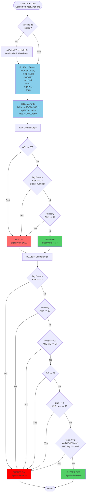

# 📊 ESP32 IoT System - Corrected Flow Chart

## 🔄 ESP32 MAIN FLOW CHART (Corrected)

```mermaid
flowchart LR

    A(["START<br/>ESP32 Power On"]) --> B(["setup()<br/>Initialize System"])

    B --> B1["Serial.begin(115200)<br/>delay(1000)"]
    B1 --> B2["Configure GPIO Pins<br/>pinMode for all pins"]
    B2 --> B3["Set FAN & BUZZER OFF<br/>digitalWrite HIGH"]
    B3 --> C["initDefaultThresholds()<br/>Load Default Thresholds"]
    
    C --> D["connectWiFi()<br/>Attempt WiFi Connection"]
    
    D --> E{"WiFi<br/>Connected?"}
    
    E -->|No| D
    E -->|Yes| G{"WiFi Still<br/>Connected?"}
    
    G -->|Yes| H["fetchThresholds()<br/>First Poll from Server"]
    G -->|No| I["ENTER MAIN LOOP"]
    
    H --> I
    
    %% MAIN LOOP
    I --> J["loop()<br/>Get currentMillis = millis()"]
    
    %% MAIN LOOP 3 PARALLEL CHECKS
    J --> K{"5 seconds<br/>elapsed?<br/>SEND_INTERVAL"}
    J --> L{"10 seconds<br/>elapsed?<br/>POLL_INTERVAL"}
    J --> M{"WiFi<br/>Connected?"}
    
    %% 5-second task: Read & Send
    K -->|Yes| N["readAndSend()"]
    
    N --> N2["checkThresholds()<br/>Find Alert Levels & AQI"]
    N2 --> N3["Control FAN & BUZZER<br/>digitalWrite GPIO pins"]
    N3 --> N4["Create JSON Payload<br/>deviceId, temperature, etc."]
    N4 --> N5["sendToServer()<br/>POST /api/data"]
    
    N5 --> O{"WiFi<br/>Connected?"}
    O -->|Yes| P["HTTP POST Success"]
    O -->|No| Q["Skip Send"]
    
    P --> R["delay(200ms)"]
    Q --> R
    
    K -->|No| R
    
    %% 10-second task: Poll Thresholds
    L -->|Yes & WiFi Connected| L1["Update lastPoll<br/>= currentMillis"]
    L1 --> S["fetchThresholds()<br/>GET /api/poll?deviceId=DEVICE001"]
    
    S --> S1["Parse JSON Response<br/>Multi-level thresholds"]
    S1 --> S2{"Has<br/>thresholds?"}
    S2 -->|Yes| S3["Update Local<br/>Threshold Structure"]
    S2 -->|No| S4["Keep Default<br/>Thresholds"]
    S3 --> R
    S4 --> R
    
    L -->|No| R
    L -->|Yes & WiFi Not Connected| R
    
    %% WiFi reconnect task
    M -->|No| M1["Reconnect WiFi<br/>connectWiFi()"]
    M1 --> M3{"WiFi<br/>Connected?"}
    M3 -->|Yes & !thresholds.loaded| M4["fetchThresholds()<br/>First time after reconnect"]
    M3 -->|No| R
    M4 --> R
    
    M -->|Yes| R
    
    %% Loop back
    R --> J
    
    style A fill:#f9f,stroke:#333,stroke-width:2px
    style C fill:#ffeb3b,stroke:#333,stroke-width:2px
    style N2 fill:#ffe08a,stroke:#333,stroke-width:2px
    style N3 fill:#ff6b6b,stroke:#333,stroke-width:2px
    style N5 fill:#b3e6ff,stroke:#333,stroke-width:2px
    style S fill:#b3e6ff,stroke:#333,stroke-width:2px
    style I fill:#ffd700,stroke:#333,stroke-width:2px
```

## 🔍 CHI TIẾT: checkThresholds() Flow

## 📝 Key Corrections Made:

1. **Setup Sequence**: Added all initialization steps in correct order (Serial, GPIO, DHT, Default Thresholds, WiFi)
2. **delay(2000)**: Added explicit 2-second delay after WiFi connection before first poll
3. **Main Loop Structure**: Shows 3 parallel checks running independently (5s, 10s, WiFi check)
4. **readAndSend() Details**: Shows complete flow from sensor reading → checkThresholds → JSON creation → sendToServer
5. **checkThresholds() Timing**: Moved inside readAndSend() (happens every 5 seconds, not independently)
6. **WiFi Reconnect Logic**: Shows proper sequence with delay(2000) and conditional fetchThresholds()
7. **delay(200)**: Added at end of loop before repeating
8. **Polling Condition**: fetchThresholds() only happens if WiFi is connected (for 10s check)

