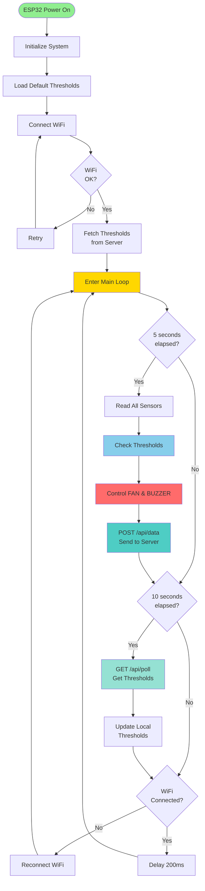
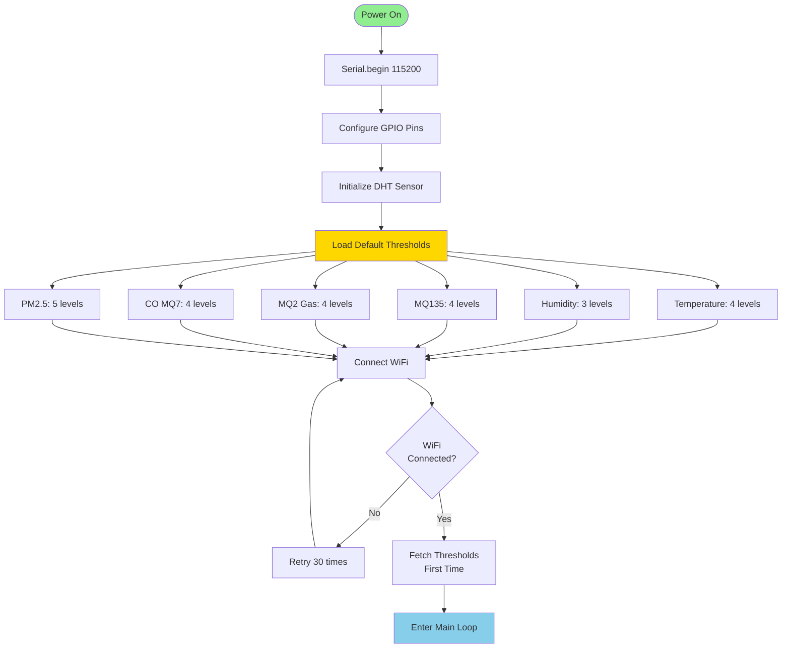
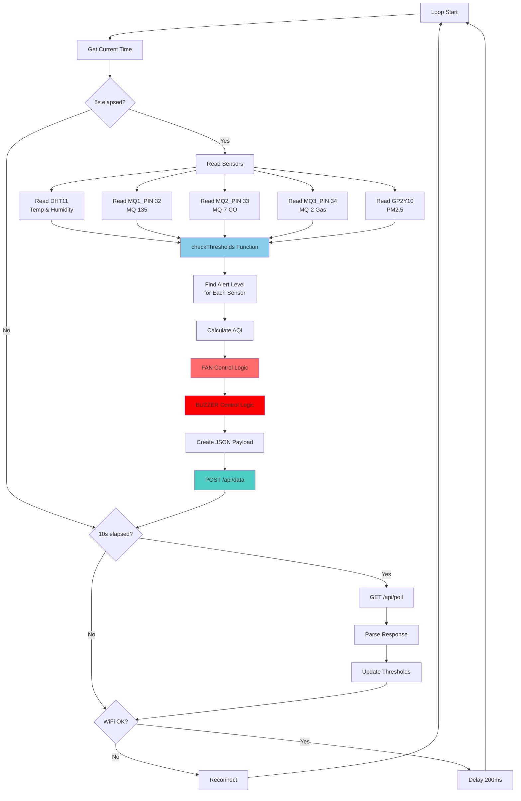
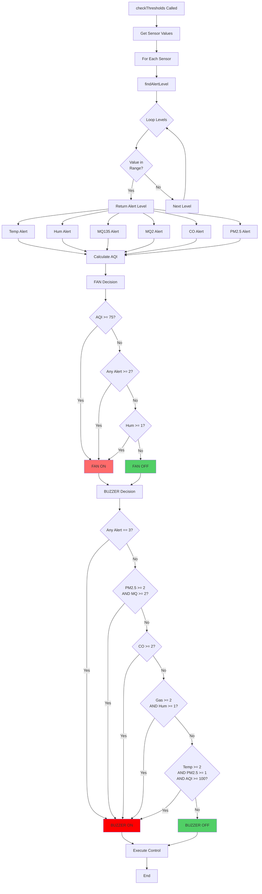
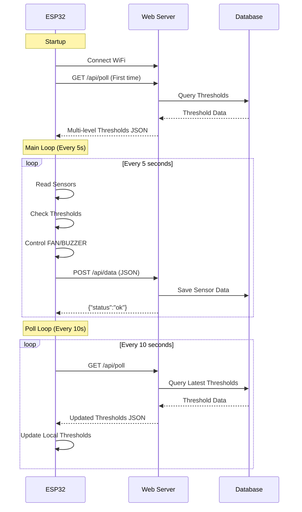

# 📊 ESP32 IoT System - Simple Flow Chart (ESP32 Focused)

## 🎯 ESP32 System Overview



---

## 🔍 ESP32 Setup Phase



---

## 🔄 ESP32 Main Loop - Detailed



---

## 🎛️ Threshold Checking & Control Logic



---

## 📡 Network Communication (Simplified)



---

## ⏱️ Timing Diagram

```
Time (seconds)
│
0s ──────────────────────────────────────────────────────────────
   │ ESP32 Startup
   │ ├─► Initialize
   │ ├─► Load Default Thresholds
   │ └─► Connect WiFi
   │
   │ IF WiFi Connected:
   │ └─► GET /api/poll (First time)
   │
5s ──────────────────────────────────────────────────────────────
   │ ├─► Read Sensors
   │ ├─► Check Thresholds
   │ ├─► Control FAN/BUZZER
   │ └─► POST /api/data
   │
10s ─────────────────────────────────────────────────────────────
   │ ├─► Read Sensors
   │ ├─► Check Thresholds
   │ ├─► Control FAN/BUZZER
   │ ├─► POST /api/data
   │ └─► GET /api/poll (Update thresholds)
   │
15s ─────────────────────────────────────────────────────────────
   │ ├─► Read Sensors
   │ ├─► Check Thresholds
   │ ├─► Control FAN/BUZZER
   │ └─► POST /api/data
   │
20s ─────────────────────────────────────────────────────────────
   │ ├─► Read Sensors
   │ ├─► Check Thresholds
   │ ├─► Control FAN/BUZZER
   │ ├─► POST /api/data
   │ └─► GET /api/poll (Update thresholds)
   │
... (Repeats every 5s for data, every 10s for polling)
```

---

## 🎯 ESP32 Key Functions

### 1. **setup()** - Initialization
- Configure GPIO pins
- Initialize DHT sensor
- Load default thresholds
- Connect WiFi
- Fetch thresholds from server (first time)

### 2. **loop()** - Main Loop
- Every 5s: Read sensors → Check thresholds → Control devices → Send data
- Every 10s: Poll server for threshold updates
- Continuously: Monitor WiFi connection

### 3. **readAndSend()** - Sensor Reading & Transmission
- Read all sensors (DHT11, MQ sensors, Dust sensor)
- Call checkThresholds()
- Create JSON payload
- Send to server via POST /api/data

### 4. **checkThresholds()** - Core Logic
- Find alert level for each sensor
- Calculate AQI
- Apply FAN control rules
- Apply BUZZER control rules
- Execute device control

### 5. **findAlertLevel()** - Threshold Matching
- Loop through threshold levels
- Find matching range for sensor value
- Return alert level, level name, and message

### 6. **calculateAQI()** - Air Quality Index
- Formula: AQI = (pm25/500)*500 + (mq7/2000)*200 + (mq135/10000)*150

### 7. **fetchThresholds()** - Get Updates from Server
- GET /api/poll?deviceId=DEVICE001
- Parse JSON response
- Update local threshold structure

### 8. **sendToServer()** - Send Data
- POST /api/data with JSON payload
- Handle WiFi disconnection gracefully

---

## 📊 ESP32 Data Structures

```
ThresholdLevel {
  String levelName;      // "Bình thường", "Nguy hiểm"
  float minValue;        // Minimum value
  float maxValue;        // Maximum value
  int alertLevel;        // 0=OK, 1=Chú ý, 2=Nguy hiểm, 3=Khẩn cấp
  String message;        // Alert message
}

SensorThresholds {
  ThresholdLevel levels[5];  // Max 5 levels per sensor
  int levelCount;            // Actual number of levels
}

ThresholdSettings {
  SensorThresholds temperature;  // 4 levels
  SensorThresholds humidity;     // 3 levels
  SensorThresholds mq2;          // 4 levels (Gas/LPG)
  SensorThresholds co;           // 4 levels (CO)
  SensorThresholds mq135;        // 4 levels (Air Quality)
  SensorThresholds pm25;         // 5 levels (Dust)
  bool loaded;                   // Loaded from server?
}
```

---

## 🔧 ESP32 Pin Configuration

| Pin | Function | Type | Description |
|-----|----------|------|-------------|
| 12  | DUST_LED_PIN | OUTPUT | Dust sensor LED control |
| 13  | DHTPIN | INPUT | DHT11 sensor data |
| 18  | FAN_PIN | OUTPUT | Fan control (LOW=ON, HIGH=OFF) |
| 19  | BUZZER_PIN | OUTPUT | Buzzer control (LOW=ON, HIGH=OFF) |
| 32  | MQ1_PIN | INPUT | MQ-135 (Air Quality) analog |
| 33  | MQ2_PIN | INPUT | MQ-7 (CO) analog |
| 34  | MQ3_PIN | INPUT | MQ-2 (Gas/LPG) analog |
| 35  | DUST_VOUT_PIN | INPUT | Dust sensor analog output |

---

## 🎯 Control Rules Summary

### FAN Control Rules:
1. **AQI >= 75** → FAN ON
2. **Any sensor AlertLevel >= 2** (except humidity) → FAN ON
3. **Humidity AlertLevel >= 1** → FAN ON

### BUZZER Control Rules:
1. **Any sensor AlertLevel == 3** (Emergency) → BUZZER ON
2. **Humidity AlertLevel >= 1** → BUZZER ON
3. **PM2.5 Alert >= 2 AND any MQ Alert >= 2** → BUZZER ON
4. **CO Alert >= 2** → BUZZER ON
5. **(MQ135 OR MQ2) Alert >= 2 AND humidity Alert >= 1** → BUZZER ON
6. **Temp Alert >= 2 AND PM2.5 Alert >= 1 AND AQI >= 100** → BUZZER ON

---

## 📝 Notes

- **ESP32 operates autonomously**: Can work without server connection using default thresholds
- **Server role**: Only for data storage and threshold updates (optional)
- **Real-time control**: All threshold checking and device control happens on ESP32
- **Network resilience**: ESP32 continues operation even if WiFi disconnects
- **Default thresholds**: Ensured system always has thresholds to work with

---

*Flow chart này tập trung hoàn toàn vào ESP32, với server và database chỉ là phần hỗ trợ đơn giản.*

