# 📊 IoT Web Application - Mermaid Flow Charts

## 🎯 System Overview

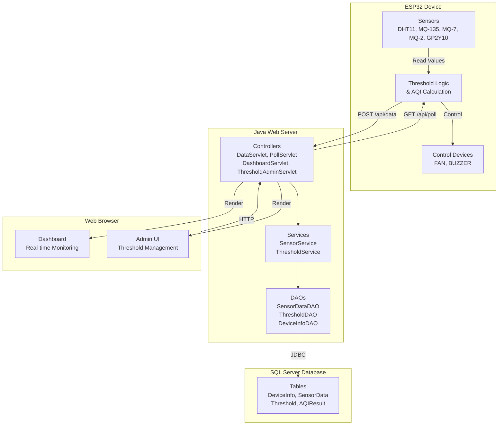

---

## 🔄 Flow 1: ESP32 Startup & Initialization

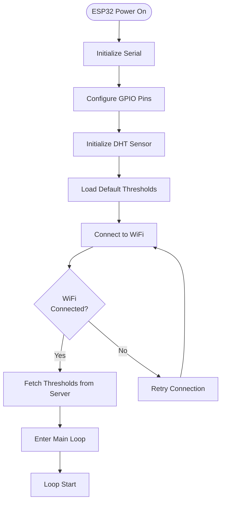

---

## 🔄 Flow 2: ESP32 Main Loop - Data Collection

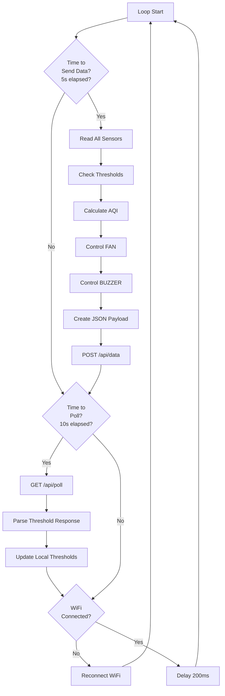

---

## 🔄 Flow 3: ESP32 → Server (Data Transmission)

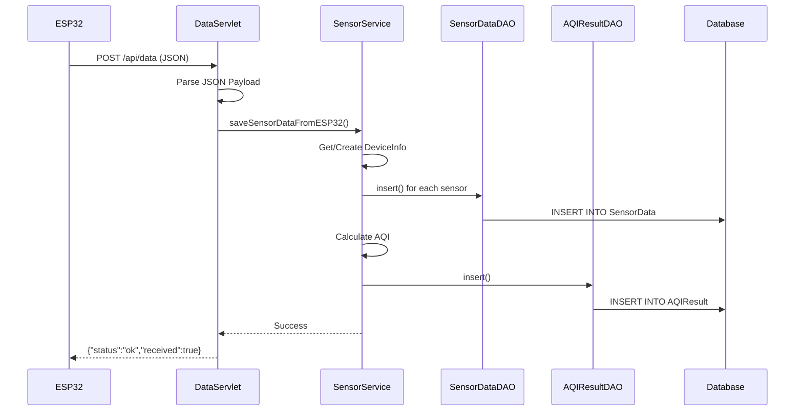

---

## 🔄 Flow 4: ESP32 ← Server (Poll Thresholds)

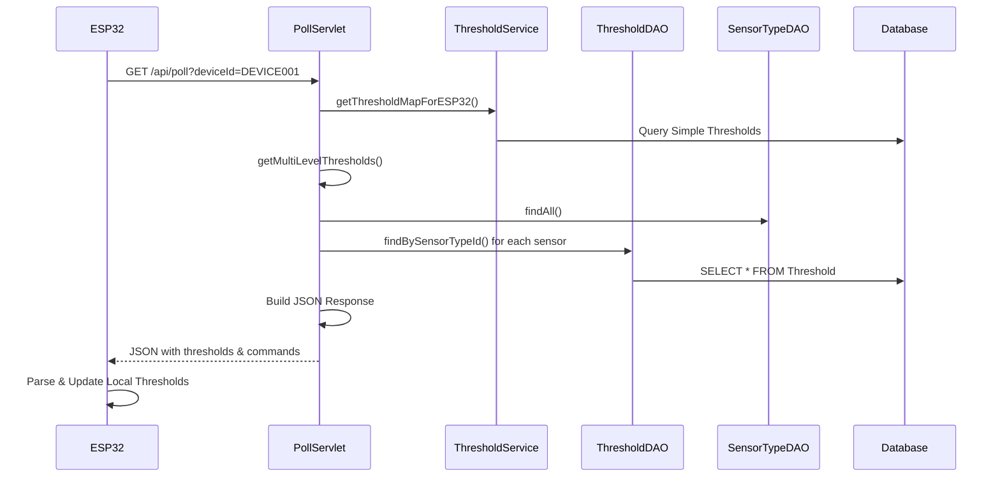

---

## 🔄 Flow 5: Threshold Checking & Device Control

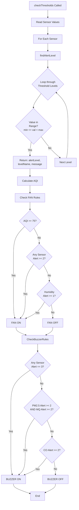

---

## 🔄 Flow 6: Dashboard Access & Display

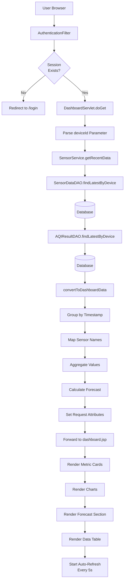

---

## 🔄 Flow 7: Dashboard Auto-Refresh

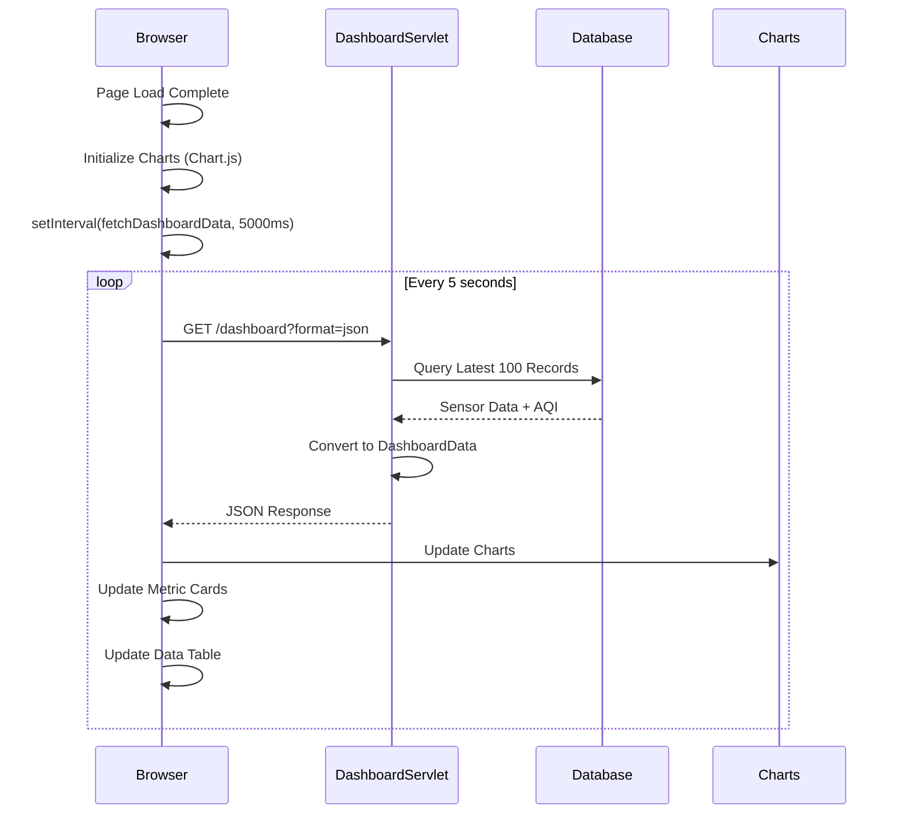

---

## 🔄 Flow 8: Threshold Management (Admin)

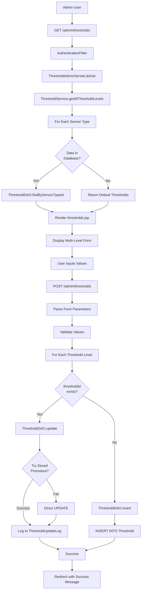

---

## 🔄 Flow 9: Complete Data Flow (End-to-End)

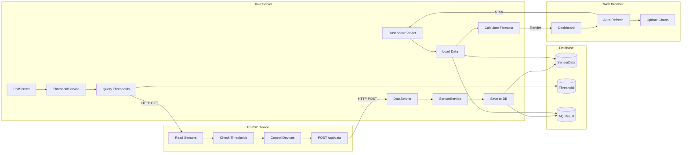

---

## 🗄️ Database Schema Relationships

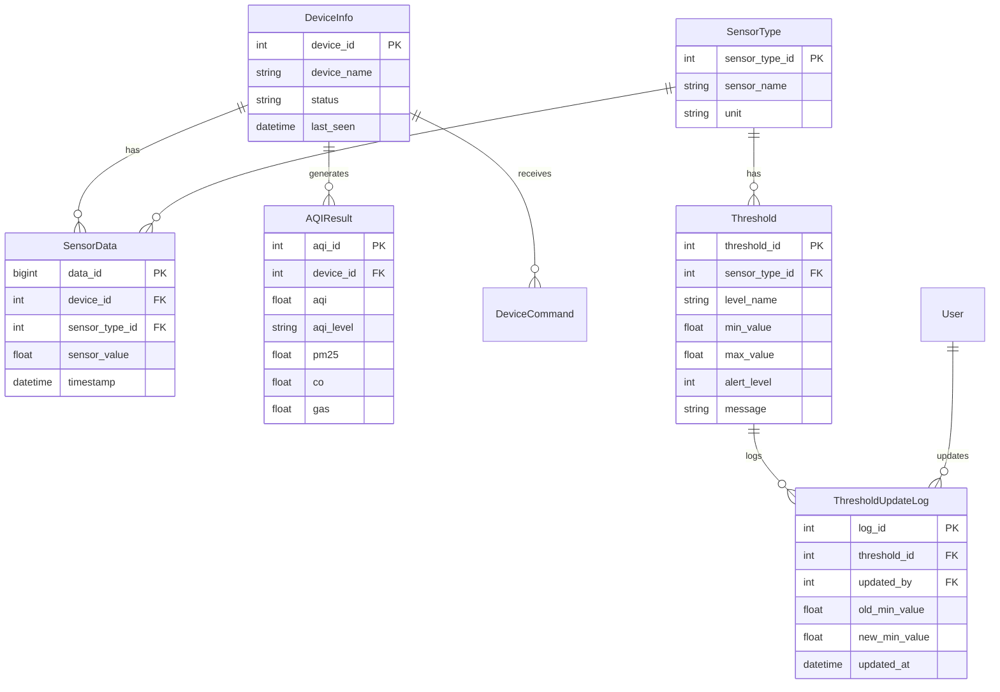

---

## ⏱️ Timing Diagram - Complete Cycle

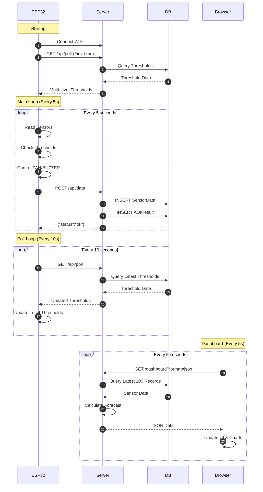

---

## 🎛️ Control Logic Flow (ESP32)

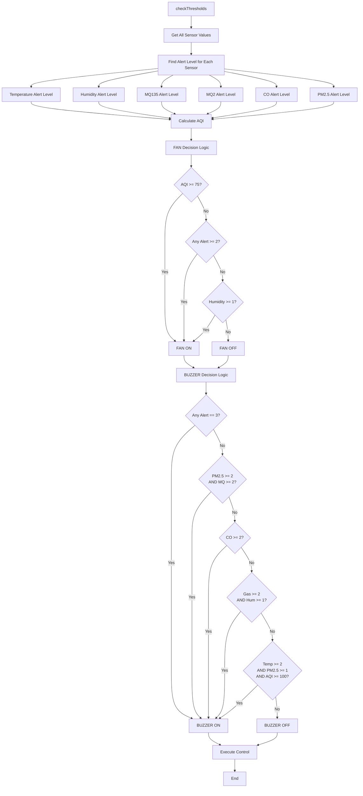

---

## 📊 Component Interaction Matrix

| Component | ESP32 | DataServlet | PollServlet | DashboardServlet | ThresholdAdminServlet | Database |
|-----------|-------|-------------|-------------|------------------|----------------------|----------|
| **ESP32** | - | POST /api/data | GET /api/poll | - | - | - |
| **DataServlet** | Receives | - | - | - | - | INSERT SensorData |
| **PollServlet** | Sends | - | - | - | - | SELECT Threshold |
| **DashboardServlet** | - | - | - | - | - | SELECT SensorData |
| **ThresholdAdminServlet** | - | - | - | - | - | UPDATE Threshold |
| **Database** | - | Stores | Queries | Queries | Updates | - |

---

## 🔄 Request-Response Patterns

### Pattern 1: Data Collection
```
ESP32 → POST /api/data → Server → Database → Response
Frequency: Every 5 seconds
```

### Pattern 2: Threshold Polling
```
ESP32 → GET /api/poll → Server → Database → Response
Frequency: Every 10 seconds
```

### Pattern 3: Dashboard View
```
Browser → GET /dashboard → Server → Database → JSP → HTML
Auto-refresh: Every 5 seconds (AJAX)
```

### Pattern 4: Threshold Update
```
Browser → POST /admin/thresholds → Server → Database → Redirect
Trigger: User submits form
```

---

*Mermaid diagrams này có thể được render trực tiếp trên GitHub, GitLab, hoặc các Markdown viewers hỗ trợ Mermaid.*

